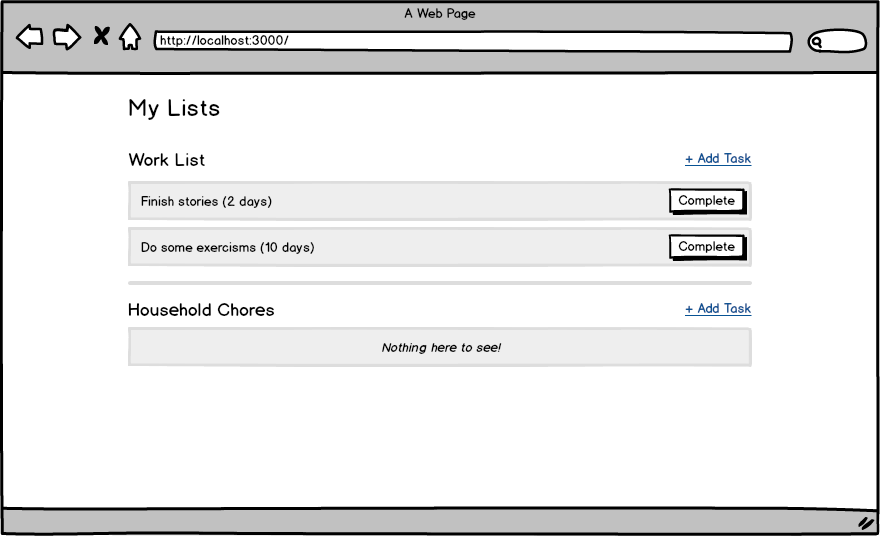
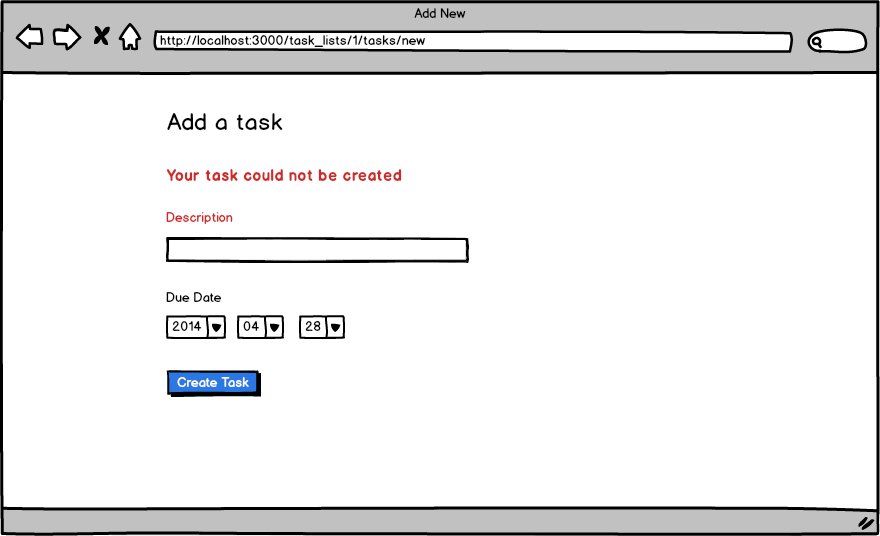
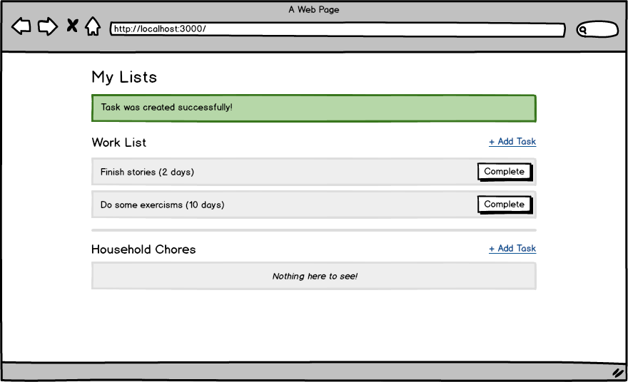

# USING THIS TEMPLATE

* `cp -r rails-practice-template my-new-thing`
* `rm -rf .git .idea`
* add a new database name to config/database.yml
* change the `replace_me_controller` with something real
* put images in the project directory and link them under `wireframes`

# Rails Practice

## Setup

* `bundle`
* `rake db:create db:migrate db:seed`
* `rails s`

You can run specs with:

* `rspec`

Note: email/password combinations for existing users populated by `rake db:seed` can be found in the db/seeds.rb file.

## Stories

**User can add a task**
```
As a user
When I log in I should see a "new task" link next to each task list name
When I click that link, I should see a description field and a date field (w/ year / month / day dropdowns)
When I fill in a description and click "Create Task" I should see the task appear beneath the task list
And I should see a flash message that reads "Task was created successfully!"
Each task should have the due date represented in relative time
```

**User must fill in description on all tasks**
```
As a user
When I am adding a task
And I don't fill in the description field
And I press "Create Task"
Then I should see a message that reads "Your task could not be created" (in maroon)
And the label for the description field should be maroon.
```

**Users can complete tasks**
```
As a user
When I go to the task lists page I should see a button to "Complete" every task
When I press that button, the task should be removed from the page
NOTE: we don't want to delete tasks from the database - just hide completed tasks from users
```

**Tasks must appear in order of their due date**
```
As a user
When I create multiple tasks in a list
Then I should see them in chronological order
```

**Task lists with empty tasks should show a friendly message**
```
As a user
When I see a task list with no tasks
Then I should see a message that reads "Nothing here to see!"
```

**Users should only be able to see tasks that they created**
```
As a user
When I visit the task lists page
Then I should only see tasks that I've created
```

**Non-logged in users should not be able to see the new task page, or be able to create a task**
```
As a non-logged in user
When I visit the new task path for any task list
Then I should be redirected to the login page
```

## Wireframes

Task lists page:



New task page:


New task page w/ errors:



Flash message:



## References

* [Flash](http://guides.rubyonrails.org/action_controller_overview.html#the-flash)
* [Date Select](http://api.rubyonrails.org/classes/ActionView/Helpers/DateHelper.html#method-i-date_select)
* [Validations in views](http://guides.rubyonrails.org/active_record_validations.html#displaying-validation-errors-in-views)
